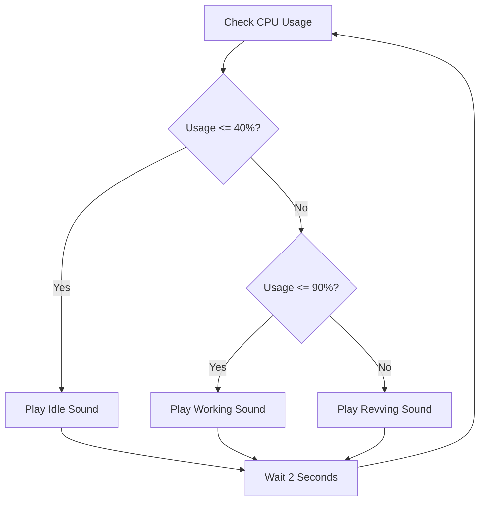

# Diesel Engine Laptop

Turn your CPU usage into a diesel engine experience. This script monitors your computer's workload and plays different engine sounds based on how hard your CPU is working.

## Prerequisites

Before starting, ensure you have the following installed on your Windows PC:

1. **Python**: [Download and Install Python](https://www.python.org/downloads/). 
   * **Important**: During installation, check the box that says **"Add Python to PATH"**.
2. **Git**: [Download and Install Git](https://git-scm.com/downloads). This allows you to download the project easily.

## Installation

Follow these steps to get the project on your computer:

1. Open the **Command Prompt** (search for "cmd" in your Start menu).
2. Type or paste the following command and press Enter:
   ```cmd
   git clone https://github.com/haarisxyz/diesel-engine-laptop.git
   ```
3. Move into the project folder:
   ```cmd
   cd diesel-engine-laptop
   ```

## Setup

1. While still in the `diesel-engine-laptop` folder in your Command Prompt, or by opening the folder in File Explorer, run the setup script:
   ```cmd
   setup.bat
   ```
   * This script will automatically install the necessary tools (`psutil` and `pygame`) and copy the sound files to your Documents folder.

## Running the Engine

You can start the script in two ways:

* **Visible Mode**: Run `python cpu.pyw` in your Command Prompt. You will see a message saying "Diesel Engine Laptop is running...".
* **Background Mode**: Double-click the `cpu.pyw` file in your File Explorer. It will run silently in the background.

## How it Works

The script checks your CPU usage every 2 seconds and switches sounds automatically:



## Customizing Sounds

You can replace the default sounds by putting your own `.mp3` or `.wav` files into the `truck-sounds` folder or `Documents\diesel-engine`. Name them as follows:
* `40`: Low load/Idle
* `70`: Medium load
* `100`: High load/Revving

## Troubleshooting

* **"python is not recognized"**: You likely forgot to check "Add Python to PATH" during installation. Re-install Python and make sure that box is checked.
* **No Sound**: Ensure your speakers are on and the volume is up. The script uses the standard Windows audio output.
* **Stopping the Script**: If running in background mode, open **Task Manager** (Ctrl+Shift+Esc), find `pythonw.exe`, right-click it, and select **End Task**.

---
Created for those who want their laptop to sound as hard-working as it feels.
